# QuantChat - Client Presentation Package

**Secure Messaging Application with Post-Quantum Cryptography**

---

## Executive Summary

QuantChat is a modern, secure messaging platform featuring:
- ✅ End-to-end encryption with post-quantum cryptography readiness
- ✅ Real-time messaging via WebSocket
- ✅ Offline-first architecture with local storage
- ✅ Media sharing (images, videos, documents up to 50MB)
- ✅ Group chat functionality
- ✅ Email-based contact invitations
- ✅ Message export to Markdown

---

## 1. System Overview Diagram

---

## 2. Security Architecture

```mermaid
graph TB
    subgraph "Security Layers"
        L1[Layer 1: Transport Security<br/>TLS 1.3 / WSS]
        L2[Layer 2: Authentication<br/>JWT Tokens + Bcrypt]
        L3[Layer 3: Message Encryption<br/>AES-256-GCM]
        L4[Layer 4: Post-Quantum Layer<br/>CRYSTALS-Kyber + Dilithium]
        L5[Layer 5: Database Encryption<br/>PostgreSQL Encryption at Rest]
    end

    subgraph "Security Features"
        F1[🔐 End-to-End Encryption]
        F2[🔑 Key Exchange Protocol]
        F3[✍️ Digital Signatures]
        F4[🛡️ SQL Injection Prevention]
        F5[🚫 XSS Protection]
        F6[⏱️ Token Expiration]
        F7[🔒 Password Hashing]
        F8[📝 Audit Logging]
    end

    L1 --> L2
    L2 --> L3
    L3 --> L4
    L4 --> L5

    L2 -.-> F6
    L2 -.-> F7
    L3 -.-> F1
    L3 -.-> F2
    L4 -.-> F3
    L5 -.-> F4
    L5 -.-> F5
    L5 -.-> F8

    style L4 fill:#E74C3C,color:#fff
    style F1 fill:#27AE60,color:#fff
    style F2 fill:#27AE60,color:#fff
    style F3 fill:#27AE60,color:#fff
```

---

## 3. Deployment Architecture

```mermaid
graph TB
    subgraph "Production Environment"
        subgraph "Frontend - Vercel"
            CDN[Vercel CDN<br/>Global Edge Network]
            Static[Static Assets<br/>React Build]
        end

        subgraph "Backend - Render"
            API1[API Instance 1<br/>FastAPI]
            API2[API Instance 2<br/>FastAPI]
            LB[Load Balancer]
        end

        subgraph "Database - Supabase"
            Primary[(Primary DB<br/>PostgreSQL)]
            Replica[(Read Replica<br/>PostgreSQL)]
        end

        subgraph "External Services"
            Relay[Relay Service<br/>Message Queue]
            Email[Resend<br/>Email Service]
            Monitor[Sentry<br/>Error Tracking]
        end
    end

    subgraph "Development Environment"
        DevFE[Local Frontend<br/>localhost:5173]
        DevBE[Local Backend<br/>localhost:8000]
        DevDB[(Local PostgreSQL)]
    end

    Internet[🌐 Internet]
    
    Internet --> CDN
    CDN --> Static
    
    Internet --> LB
    LB --> API1
    LB --> API2
    
    API1 --> Primary
    API2 --> Primary
    Primary --> Replica
    
    API1 --> Relay
    API2 --> Relay
    API1 --> Email
    API1 --> Monitor
    
    DevFE -.->|Development| DevBE
    DevBE -.->|Development| DevDB

    style CDN fill:#000,color:#fff
    style LB fill:#27AE60,color:#fff
    style Primary fill:#9B59B6,color:#fff
    style Relay fill:#F39C12,color:#fff
```

---

## 4. Message Lifecycle Diagram

---

## 5. Offline-First Architecture

---

## 6. Feature Breakdown

---

## 7. Technology Stack Summary

---

## 8. Post-Quantum Cryptography Roadmap

---

## 9. Performance Metrics

---

## 10. Security Compliance

```mermaid
graph TB
    subgraph "Compliance Standards"
        C1[GDPR<br/>Data Privacy]
        C2[NIST<br/>Cryptography]
        C3[OWASP<br/>Security]
        C4[ISO 27001<br/>Information Security]
    end

    subgraph "Implementation"
        I1[✅ Data Encryption at Rest]
        I2[✅ Data Encryption in Transit]
        I3[✅ User Consent Management]
        I4[✅ Right to be Forgotten]
        I5[✅ Access Control]
        I6[✅ Audit Logging]
        I7[✅ Secure Key Storage]
        I8[✅ Regular Security Updates]
    end

    subgraph "Certifications"
        T1[🎯 SOC 2 Type II<br/>In Progress]
        T2[🎯 ISO 27001<br/>Planned]
        T3[✅ NIST PQC<br/>Ready]
    end

    C1 --> I3
    C1 --> I4
    C2 --> I1
    C2 --> I2
    C2 --> I7
    C3 --> I5
    C3 --> I6
    C4 --> I8

    I1 --> T1
    I2 --> T1
    I5 --> T2
    I7 --> T3

    style C2 fill:#E74C3C,color:#fff
    style T3 fill:#27AE60,color:#fff
```

---

## Key Differentiators

### 1. Post-Quantum Cryptography Ready
- First messaging app with CRYSTALS-Kyber integration
- Future-proof against quantum computing threats
- Hybrid mode for backward compatibility

### 2. Offline-First Architecture
- Messages work without internet
- Automatic sync when online
- Zero data loss guarantee

### 3. Local-First Storage
- Instant message display from IndexedDB
- Privacy-focused (data on device)
- Export conversations anytime

### 4. Enterprise-Grade Security
- End-to-end encryption
- Zero-knowledge architecture
- Regular security audits

### 5. Developer-Friendly
- Open architecture
- Well-documented APIs
- Easy integration

---

## Next Steps for Client

1. **Review Diagrams**: Understand system architecture
2. **Security Audit**: Third-party security review
3. **Performance Testing**: Load testing with 10K users
4. **Compliance Check**: GDPR/HIPAA requirements
5. **Deployment Plan**: Production rollout strategy
6. **Training**: User and admin training materials
7. **Support Plan**: 24/7 support infrastructure

---

## Contact & Support

**Project Repository**: GitHub (Private)  
**Documentation**: `/docs` folder  
**API Documentation**: `https://api.quantchat.com/docs`  
**Support Email**: support@quantchat.com  
**Emergency Hotline**: +1-XXX-XXX-XXXX

---

**Document Version**: 1.0  
**Last Updated**: January 29, 2026  
**Prepared For**: Client Presentation  
**Prepared By**: Development Team
