# QuantChat - Complete System Diagrams

**Project:** Secure Messaging Application with Post-Quantum Cryptography  
**Version:** 1.0  
**Date:** January 29, 2026

---

## Table of Contents
1. [Entity Relationship Diagram (ERD)](#1-entity-relationship-diagram-erd)
2. [Data Flow Diagram (DFD)](#2-data-flow-diagram-dfd)
3. [User Flow Diagram](#3-user-flow-diagram)
4. [Post-Quantum Cryptography Architecture](#4-post-quantum-cryptography-architecture)
5. [System Architecture](#5-system-architecture)
6. [WebSocket Communication Flow](#6-websocket-communication-flow)

---

## 1. Entity Relationship Diagram (ERD)

---

## 2. Data Flow Diagram (DFD)

### Level 0 - Context Diagram

```mermaid
graph TB
    User[👤 User]
    System[QuantChat<br/>Secure Messaging System]
    Database[(PostgreSQL<br/>Database)]
    RelayService[Relay Service<br/>Message Queue]
    EmailService[Email Service<br/>Resend]

    User -->|Login/Register| System
    User -->|Send Messages| System
    User -->|Upload Media| System
    System -->|Receive Messages| User
    System -->|Notifications| User
    
    System <-->|Store/Retrieve Data| Database
    System <-->|Queue Messages| RelayService
    System -->|Send Invitations| EmailService
    
    style System fill:#4A90E2,color:#fff
    style Database fill:#50C878,color:#fff
    style RelayService fill:#FF6B6B,color:#fff
    style EmailService fill:#FFD93D,color:#000
```

### Level 1 - Main Processes

### Level 2 - Message Flow Detail

```mermaid
sequenceDiagram
    participant U1 as User 1 (Sender)
    participant FE1 as Frontend 1
    participant LDB1 as IndexedDB 1
    participant WS as WebSocket Server
    participant API as Message API
    participant DB as PostgreSQL
    participant Relay as Relay Service
    participant FE2 as Frontend 2
    participant LDB2 as IndexedDB 2
    participant U2 as User 2 (Recipient)

    U1->>FE1: Type & Send Message
    FE1->>FE1: Generate Message ID
    FE1->>LDB1: Save (synced=false)
    FE1->>FE1: Encrypt Content
    FE1->>WS: Send via WebSocket
    
    WS->>API: Forward Message
    API->>DB: Store Message
    API->>Relay: Queue for Recipient
    API-->>WS: Confirm Sent
    
    WS-->>FE1: message_sent event
    FE1->>LDB1: Update (synced=true)
    FE1->>U1: Show "Sent" ✓
    
    alt Recipient Online
        WS->>FE2: new_message event
        FE2->>LDB2: Save Message
        FE2->>U2: Display Message
        FE2->>WS: delivery_confirmation
        WS->>FE1: message_delivered
        FE1->>U1: Show "Delivered" ✓✓
    else Recipient Offline
        Relay->>Relay: Store in Queue
        Note over Relay: Wait for recipient
        FE2->>WS: Connect (later)
        WS->>Relay: Fetch Pending
        Relay-->>WS: Return Messages
        WS->>FE2: Deliver Messages
        FE2->>LDB2: Save Messages
        FE2->>U2: Display Messages
    end
```

---

## 3. User Flow Diagram

### Complete User Journey

---

## 4. Post-Quantum Cryptography Architecture

### PQC Layer Integration

### PQC Algorithm Stack

### Cryptographic Message Flow

---

## 5. System Architecture

### High-Level Architecture

### Technology Stack

---

## 6. WebSocket Communication Flow

### Real-Time Message Exchange

```mermaid
sequenceDiagram
    participant C1 as Client 1<br/>(Sender)
    participant WS1 as WebSocket<br/>Connection 1
    participant Server as WebSocket<br/>Server
    participant DB as Database
    participant Relay as Relay<br/>Service
    participant WS2 as WebSocket<br/>Connection 2
    participant C2 as Client 2<br/>(Recipient)

    Note over C1,C2: Connection Establishment
    
    C1->>WS1: Connect(user_id, jwt_token)
    WS1->>Server: Authenticate
    Server->>Server: Verify JWT
    Server-->>WS1: Connection Accepted
    WS1-->>C1: Connected ✓
    
    C2->>WS2: Connect(user_id, jwt_token)
    WS2->>Server: Authenticate
    Server->>Server: Verify JWT
    Server-->>WS2: Connection Accepted
    WS2-->>C2: Connected ✓
    
    Note over C1,C2: Fetch Pending Messages
    
    Server->>Relay: Get Pending(user_id)
    Relay-->>Server: Pending Messages[]
    Server->>WS1: Deliver Pending
    Server->>WS2: Deliver Pending
    
    Note over C1,C2: Real-Time Messaging
    
    C1->>WS1: Send Message
    WS1->>Server: {type: "message", data}
    Server->>DB: Store Message
    Server->>Relay: Queue Message
    
    alt Recipient Online
        Server->>WS2: new_message event
        WS2->>C2: Display Message
        C2->>WS2: delivery_confirmation
        WS2->>Server: Delivered
        Server->>WS1: message_delivered
        WS1->>C1: Update Status ✓✓
    else Recipient Offline
        Server->>Relay: Store for Later
        Note over Relay: Message queued
    end
    
    Note over C1,C2: Typing Indicators
    
    C1->>WS1: typing: true
    WS1->>Server: {type: "typing"}
    Server->>WS2: typing event
    WS2->>C2: Show "typing..."
    
    Note over C1,C2: Read Receipts
    
    C2->>WS2: Mark as Read
    WS2->>Server: {type: "read"}
    Server->>DB: Update is_read
    Server->>WS1: message_read
    WS1->>C1: Update Status ✓✓ (blue)
    
    Note over C1,C2: Disconnection Handling
    
    C2->>WS2: Disconnect
    WS2->>Server: Connection Closed
    Server->>WS1: user_offline
    WS1->>C1: Show Offline Status
```

### WebSocket Event Types

---

## How to Use These Diagrams

### For Mermaid Live Editor (Recommended)
1. Visit: https://mermaid.live/
2. Copy any diagram code block
3. Paste into the editor
4. Export as PNG/SVG/PDF

### For VS Code
1. Install "Markdown Preview Mermaid Support" extension
2. Open this file in VS Code
3. Press `Ctrl+Shift+V` to preview
4. Right-click diagrams to export

### For Documentation
1. Use Mermaid CLI: `npm install -g @mermaid-js/mermaid-cli`
2. Convert to images: `mmdc -i DIAGRAMS.md -o output.pdf`

### For Client Presentation
1. Export each diagram as PNG (high resolution)
2. Create PowerPoint/PDF with diagrams
3. Add explanatory notes for each diagram

---

## Diagram Descriptions for Client

### 1. ER Diagram
Shows the complete database structure with 8 main tables: Users, Contacts, Messages, Groups, Group Members, Group Messages, Media Attachments, and Invitations. All relationships and foreign keys are clearly defined.

### 2. Data Flow Diagram
Illustrates how data moves through the system from user input to storage and delivery. Shows three levels: Context (high-level), Main Processes (detailed), and Message Flow (sequence).

### 3. User Flow Diagram
Complete user journey from opening the app to sending messages, including authentication, contact management, message delivery, and offline handling.

### 4. PQC Architecture
Demonstrates the post-quantum cryptography layer with CRYSTALS-Kyber for key exchange and CRYSTALS-Dilithium for signatures. Shows hybrid mode combining classical and quantum-resistant algorithms.

### 5. System Architecture
High-level view of frontend (React), backend (FastAPI), databases (PostgreSQL, Redis), and external services (Relay, Email).

### 6. WebSocket Communication
Real-time bidirectional communication flow showing connection establishment, message exchange, typing indicators, read receipts, and offline handling.

---

**End of Diagrams Document**
